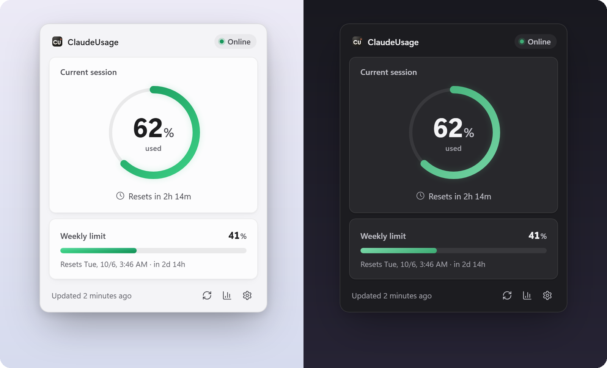
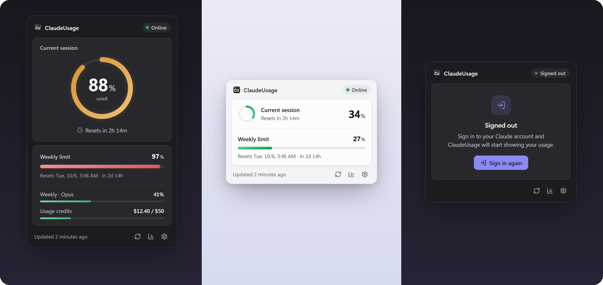
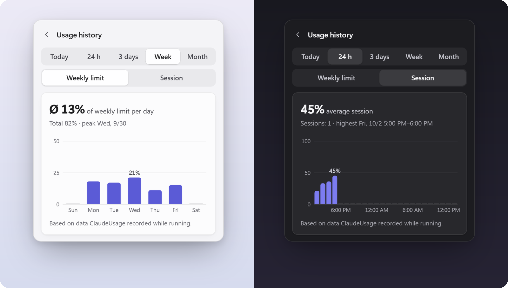
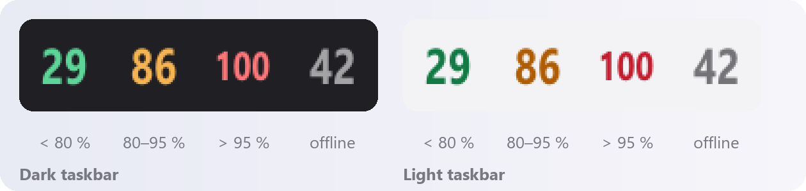
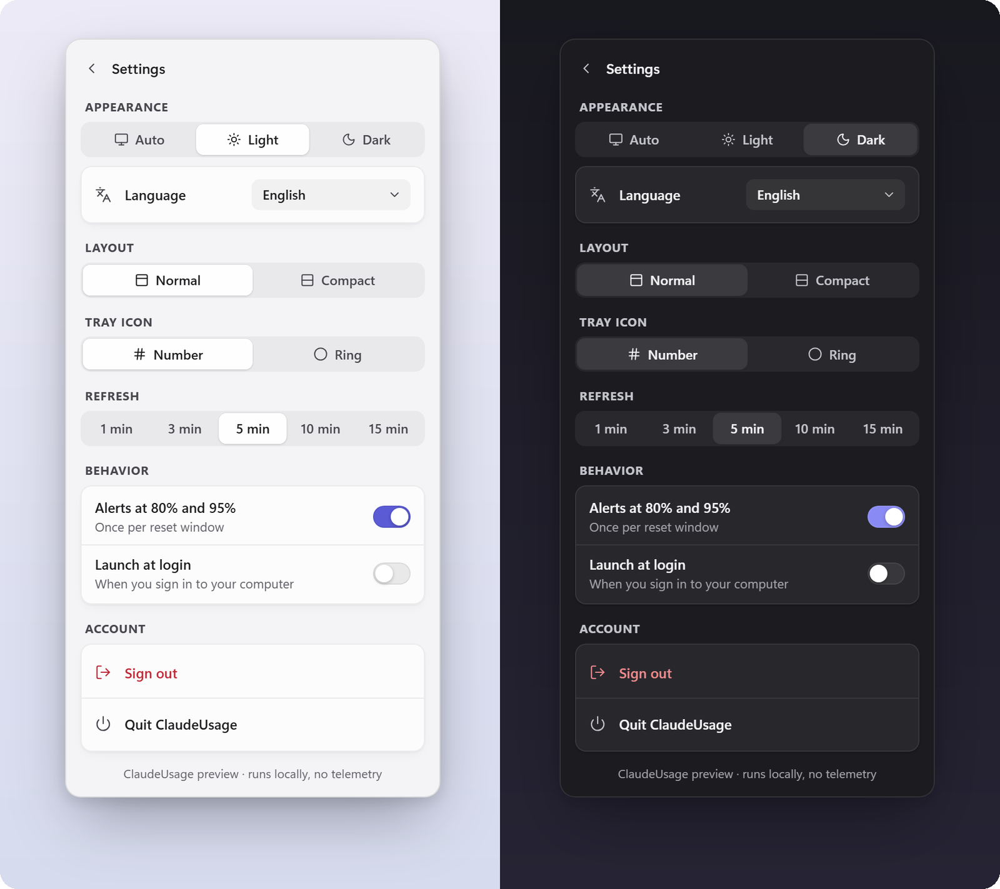

<div align="center">


# ClaudeUsage

**See your Claude usage limits at a glance: a tiny system tray (Windows) and menu bar (macOS) app.**

Current 5-hour session, weekly limit, reset countdowns, alerts at 80% and 95%, and a usage history chart.<br>
Runs locally. No telemetry. No copied cookies or API keys.

[](https://github.com/mykolastoyka-plexima/ClaudeUsage/actions/workflows/build.yml)


[Download](#download) · [Features](#features) · [How it works](#how-it-works) · [FAQ](#faq) · [Build from source](#build-from-source) · [Česky](README.cs.md)



</div>

## Why

Claude plans (Pro, Max, Team) limit how much you can use in a rolling **5-hour session** and per **week**. The only place to check is the usage page on claude.ai, which is easy to forget until you hit the wall. ClaudeUsage keeps the numbers in your taskbar or menu bar, colour-codes them and tells you before you run out.

## Features

- **Live tray / menu bar icon:** the current session percentage as a large coloured number (or a progress ring). Green below 80%, orange from 80% to 95%, red above 95%. The colours are tuned separately for light and dark taskbars.
- **One-click popover** with the current session, the weekly limit, the exact reset time and a live countdown. Any extra weekly limits (for example per model) or usage credits are shown only when your account has them.
- **Usage history chart** for today, the last 24 hours, 3 days, a week or a month: average consumption of the weekly limit per hour or day, and the average peak of your sessions.
- **Alerts at 80% and 95%**, once per reset window, not on every refresh.
- **Light, dark or automatic theme** that follows the system live, with native Acrylic (Windows 11) or vibrancy (macOS) backgrounds.
- **Normal and compact layout**, refresh every 1, 3, 5, 10 or 15 minutes, launch at login.
- **8 languages:** English, Czech, Ukrainian, German, French, Spanish, Italian and Polish, picked from the system or set manually.
- **Offline-aware:** keeps showing the last known numbers, marked offline, when the network drops. A clear "Signed out" state with a one-click sign-in when the claude.ai session expires.
- **Small and private:** about a 1.5 MB installer, built with Rust and Tauri 2. All data stays on your computer.

<div align="center">

<br><sub>Near the limit (with sample extra limits) · compact layout · signed out</sub>
<br><br>

<br><sub>Usage history: weekly limit per day · session peaks over 24 hours</sub>
<br><br>

<br><sub>Tray icon on dark and light taskbars</sub>
<br><br>

<br><sub>Settings</sub>
</div>

> Screenshots use sample data.

## Download

Get the installer from the **[latest release](https://github.com/mykolastoyka-plexima/ClaudeUsage/releases/latest)**. Development builds are attached as artifacts to each run of the [Build workflow](https://github.com/mykolastoyka-plexima/ClaudeUsage/actions/workflows/build.yml).

| Platform | File |
|---|---|
| Windows 10/11, x64 (Intel/AMD) | `ClaudeUsage_<version>_x64-setup.exe` |
| Windows 11 on ARM | `ClaudeUsage_<version>_arm64-setup.exe` |
| macOS 11+ (Apple Silicon and Intel) | `ClaudeUsage_<version>_universal.dmg` |

### Windows

Run the installer. It installs for the current user, no admin rights needed. The installers are not code-signed yet, so SmartScreen may warn on first launch: choose **More info → Run anyway**.

A new version installs over the old one and keeps your settings, sign-in and history.

### macOS

Open the `.dmg` and drag **ClaudeUsage** into Applications. The app is ad-hoc signed but not notarized, so macOS asks for confirmation the first time:

1. Open ClaudeUsage once (macOS will refuse).
2. Go to **System Settings → Privacy & Security** and click **Open Anyway**.

If macOS says the app is damaged, remove the download quarantine flag:

```bash
xattr -cr /Applications/ClaudeUsage.app
```

The app lives only in the menu bar (no Dock icon). On a MacBook with a notch, a crowded menu bar can hide it.

macOS support is new and built on CI; Windows is the main tested platform. Please [open an issue](https://github.com/mykolastoyka-plexima/ClaudeUsage/issues) if something does not work on your Mac.

### First run

A window with the claude.ai sign-in page opens. Sign in as usual (**Continue with email** is the most reliable; Google sometimes blocks embedded browsers). The window closes by itself and the numbers appear within seconds.

## How it works

ClaudeUsage reads the same data as the official usage page, [claude.ai/settings/usage](https://claude.ai/settings/usage). The page loads it from:

```
GET https://claude.ai/api/organizations/{org_uuid}/usage
```

The app reads the `limits` list from that response (`kind`, `percent`, `resets_at`), which is exactly what the official page renders.

1. You sign in once in an app window. The session stays in the app's own persistent WebView profile. Nothing is copied by hand.
2. On each refresh, a hidden webview on the `claude.ai` origin calls the endpoint with `fetch`, so the request carries the profile's cookies like the official page does.
3. The result comes back over Tauri IPC. The remote page may call exactly one command, `usage_report` ([`capabilities/fetcher.json`](src-tauri/capabilities/fetcher.json)).
4. A `401` (or a JSON `403`) switches to "Signed out". A network error keeps the last numbers and marks them offline.

The usage history is not available from claude.ai. ClaudeUsage records its own samples (only when values change, plus a heartbeat every 15 minutes) and keeps 35 days locally. The chart therefore covers the time the app was running.

> The endpoint is an internal claude.ai API, not a public one. If it changes, the app shows "Unexpected data format" until [`model.rs`](src-tauri/src/model.rs) is updated.

## Privacy

- No telemetry, analytics or third-party servers. The app talks only to `claude.ai`.
- No cookies, tokens or passwords are read or stored by the app. The sign-in lives in the WebView profile, as in a browser.
- **Sign out** in Settings wipes the WebView profile (cookies, storage, cache).

| Data | Windows | macOS |
|---|---|---|
| Settings | `%APPDATA%\com.mykola.claudeusage\settings.json` | `~/Library/Application Support/com.mykola.claudeusage/settings.json` |
| Usage history (35 days) | `%APPDATA%\com.mykola.claudeusage\history.jsonl` | `~/Library/Application Support/com.mykola.claudeusage/history.jsonl` |
| Sign-in (WebView profile) | `%LOCALAPPDATA%\com.mykola.claudeusage\EBWebView` | WebKit data store of the app |

## FAQ

**How do I check my Claude usage limits?**
On the web: claude.ai → Settings → Usage. With ClaudeUsage the same numbers sit in your tray or menu bar and refresh automatically.

**Which plans does it work with?**
Any account that shows limits on claude.ai/settings/usage. It was developed and tested with a Team plan. The app shows whatever limits your account reports.

**Does it use the Anthropic API or an API key?**
No. It reads the usage of your claude.ai subscription through your normal sign-in. API (Console) usage and billing are not covered.

**Why is the history chart empty?**
claude.ai has no usage history, so ClaudeUsage builds it from its own refreshes. The chart fills in while the app runs.

**Can I change the language?**
Yes. Settings → Language. "Automatic" follows the system language and falls back to English.

**Is it safe to sign in inside the app?**
The sign-in window is the real claude.ai page in a WebView. The app never sees your password, and the hidden fetcher can only send the usage response back (see [How it works](#how-it-works)).

## Build from source

Requirements: [Node.js](https://nodejs.org/) 20+, [Rust](https://rustup.rs/) stable, and the Tauri [prerequisites](https://v2.tauri.app/start/prerequisites/) for your OS (Windows: Visual Studio Build Tools with C++ and WebView2; macOS: Xcode Command Line Tools).

```bash
npm install
npm run tauri dev
```

The app has no main window; look for the icon in the tray or menu bar.

**Design preview without Tauri:** `npm run dev` and open http://localhost:1420. It runs on sample data. Parameters switch states:

```
?s=online|offline|logged_out|loading|nodata  &p=62  &w=84  &x=1  &theme=light|dark  &d=compact  &lang=de  &panel=history|settings
```

**Installers:**

```bash
# Windows: one NSIS installer per architecture
npm run tauri build -- --bundles nsis --target x86_64-pc-windows-msvc
npm run tauri build -- --bundles nsis --target aarch64-pc-windows-msvc

# macOS: universal .dmg (Apple Silicon + Intel)
rustup target add aarch64-apple-darwin x86_64-apple-darwin
npm run tauri build -- --target universal-apple-darwin --bundles dmg
```

Output: `src-tauri/target/<target>/release/bundle/`.

The [Build workflow](.github/workflows/build.yml) builds all three installers on GitHub Actions. Run it manually, or push a `v*` tag to also create a draft release with the installers attached.

**Tests:**

```bash
cd src-tauri && cargo test                          # usage response parsing
cd src-tauri && cargo test tray_preview -- --ignored # renders every tray icon variant to target/tray-preview/
```

**Releasing a version:** bump `version` in `package.json`, `src-tauri/Cargo.toml` and `src-tauri/tauri.conf.json` (they must match). Settings shows the version read from the app.

### Project structure

```
ClaudeUsage/
├─ index.html, src/            popover UI (vanilla TypeScript + Vite, no framework)
│  ├─ main.ts                  rendering, animations, settings, panel switching
│  ├─ history-panel.ts         usage history chart (SVG)
│  ├─ lib/i18n.ts              UI strings in 8 languages
│  ├─ lib/usage-history.ts     consumption and averages from recorded samples
│  └─ styles/                  design tokens (light/dark) and styles
├─ assets/app-icon.svg         app icon source
└─ src-tauri/
   ├─ src/lib.rs               state, commands, tray, refresh scheduler
   ├─ src/fetcher.rs           hidden claude.ai webview and sign-in window
   ├─ src/model.rs             usage response model (+ tests)
   ├─ src/history.rs           local usage history (JSON lines, 35 days)
   ├─ src/lang.rs              tray, menu and notification strings
   ├─ src/tray_icon.rs         tray icon rendering (number, ring, macOS template)
   ├─ src/popover.rs           positioning, Acrylic/vibrancy, rounded corners
   ├─ src/notify.rs            80% / 95% alerts, once per window
   ├─ nsis/Czech.nsh           Czech installer strings
   └─ capabilities/            permissions: popover UI and claude.ai fetcher
```

## Disclaimer

ClaudeUsage is an independent, unofficial project. It is not affiliated with, endorsed by or supported by Anthropic. "Claude" is a trademark of Anthropic, PBC. The app relies on an internal claude.ai endpoint that may change at any time.
